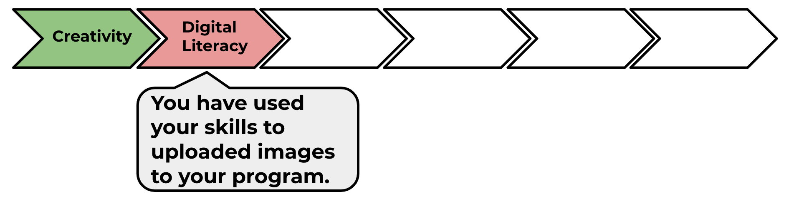

--- challenge ---
## Challenge: keep going!
Use what you've learnt in this project to finish telling your story! Here's an example:

Go to the next project on the HTML & CSS module pathway: 'Wanted!'

--- /challenge ---

Click on the 'Click me' button to try the next project:

<a href="hhttps://codeclub.org/en/html1">

